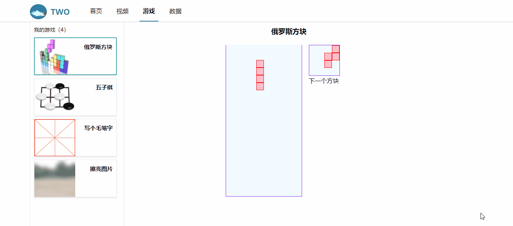
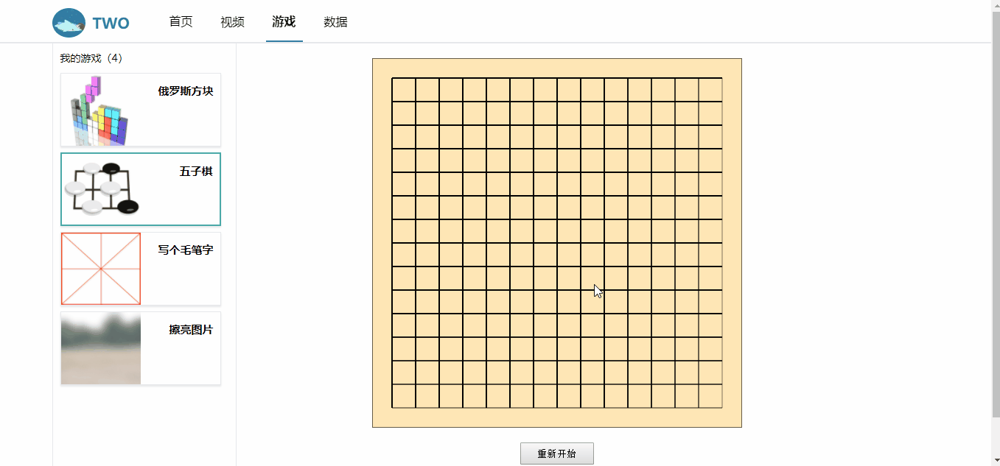
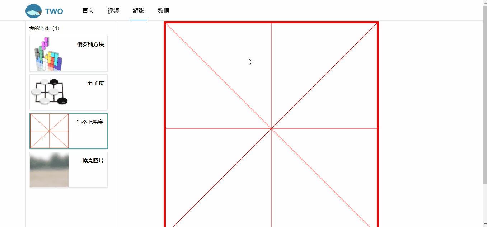
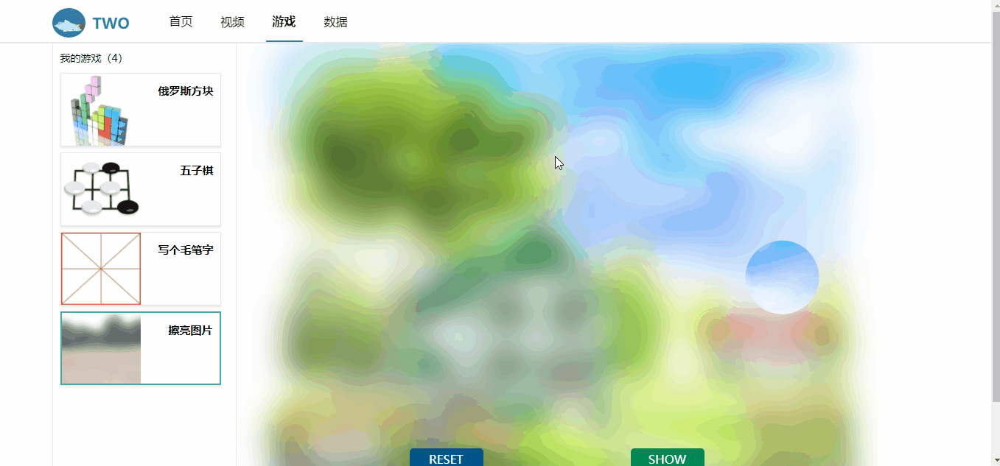

# Nuxt-Portal

一个基于Nuxt的服务端渲染的pc端门户网站,主要由新闻资讯，弹幕视频，游戏大厅，echarts练手构成。体验了一把基于Vue的SSR，首屏主要信息由服务端渲染，次要一点的、不需要第一时间显示的数据由客户端渲染。ps：主要用了36氪的api。

## 已完成功能

1. 浏览新闻资讯；
2. 看视频；
3. 发弹幕；
4. 小游戏；
5. 数据浏览；

## 项目截图

首页

新闻详情页

视频页

播放视频

弹幕功能

视频普通、剧场、全屏模式

俄罗斯方块

五子棋

写字&擦亮图片

echarts尝试

